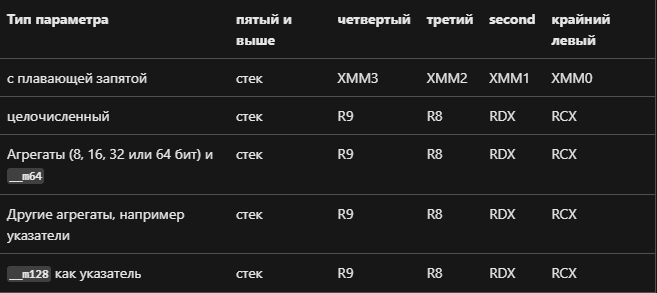

# Артемов Никита Владиславович БПИ219
## Вариант 29

Разработать программу, которая ищет в ASCII-строке слова — палиндромы и формирует из них новую строку, 
в которой слова разделяются пробелами. Слова состоят из букв. Все остальные символы являются разделителями слов.

#### Задание решено на:
- [4-5 баллов]()
- [6 баллов]()
- [7 баллов]()
- [8 баллов]()

## Решение на 4-5 баллов
Исходный код на C: [main.c](./bridge/main.c)
```sh
#include <stdint.h>
#include <stdio.h>
#include <stdlib.h>
#include <string.h>
#include <time.h>

// variant 29

int getRandomNumber(int start, int end) {
    return rand() % (end + 1 - start) + start;
}

int main(int argc, char* argv[]) {
    srand(time(NULL));
    if (argc < 2 || argc > 4) {
        printf("%s\n",
               "Вы обязаны ввести 1,2 или 3 аргумента командной строки:\n"
               "Первый - -f/-r/-c.\n"
               "Второй и третий опциональны, "
               "это абсолютный путь к файлам ввода и вывода.");
        return 0;
    }
    FILE* file = NULL;
    if (!strcmp(argv[1], "-f")) {
        if (argc > 2) {
            file = fopen(argv[2], "r");
        } else {
            file = fopen("string_in.txt", "r");
        }
        if (file == NULL) {
            printf("%s\n",
                   "Ошибка! Файл ввода не может быть открыт.\n"
                   "Файл должен существовать и быть формата txt.");
            return 0;
        }
    }
    int n = 0;
    char* string = malloc(65536);

    if (!strcmp(argv[1], "-r")) {
        n = getRandomNumber(1, 10000);
        for (int i = 0; i < n; i++) {
            if (getRandomNumber(0, 16) > 13) {
                string[i] = ' ';
            } else {
                string[i] = getRandomNumber(97, 122);
            }
        }
    } else if (!strcmp(argv[1], "-f")) {
        int ch;
        do {
            ch = fgetc(file);
            string[n++] = ch;
        } while (ch != -1);
        string[n - 1] = '\0';
    } else {
        int ch;
        do {
            ch = fgetc(stdin);
            string[n++] = ch;
        } while (ch != -1);
        string[n - 1] = '\0';
    }

    unsigned int start_time = clock();
    char* total = malloc(n);
    int len = 0;
    int start, end = -1;
    for (int i = 0; i < n; i++) {
        int temp = i;
        if (string[i] > 96 && string[i] < 123) {
            if (end + 1 == i) {
                start = i;
            }
            if (i < n - 1) {
                continue;
            }
            temp++;
        }
        end = temp;
        int isPal = 1;
        int k = end - start;
        for (int j = 0; j < k / 2; j++) {
            if (string[start + j] != string[end - j - 1]) {
                isPal = 0;
                break;
            }
        }
        if (isPal == 1) {
            for (int j = start; j < end; j++) {
                total[len++] = string[j];
            }
            total[len++] = ' ';
        }
    }
    total[len] = '\0';

    unsigned int end_time = clock();
    printf("%s", "Время выполнения программы: ");
    printf("%d", end_time - start_time);
    printf("%s\n", "мс");

    if (!strcmp(argv[1], "-f")) {
        fclose(file);
        file = NULL;
    }
    if (strcmp(argv[1], "-c")) {
        if (argc == 4) {
            file = fopen(argv[3], "w");
        } else {
            file = fopen("string_out.txt", "w");
        }
    }

    if (!strcmp(argv[1], "-c")) {
        puts(total);
    } else {
        fputs(total, file);
    }

    if (strcmp(argv[1], "-c")) {
        fclose(file);
    }

    if (total != NULL) {
        free(total);
    }

    if (string != NULL) {
        free(string);
    }
    return 0;
}
```

В реализованной функции использованы функции с передачей данных через параметры, а также локальные переменные.
Связь регистров и параметров функций в языке Си: 

#### Порядок аргументов командной строки:
1. -f/-r/-с (файловый ввод и вывод / строка генерируется рандомно и выводится в файл / консольный ввод) 
— обязательный аргумент
2. <полный путь к файлу для ввода строки> — необязательный аргумент
3. <полный путь к файлу для вывода строки> — необязательный аргумент

При вводе некорректных данных - UB, поэтому требование к работе с программой - это ввод корректных данных.
Корректными данными считается строка из строчных латинских букв и разделителей.
Файл для чтения или записи должен быть формата .txt, иначе - UB.

#### По умолчанию:
- ввод происходит из файла [string_in.txt](./bridge/string_in.txt)
- вывод происходит в файл [string_out.txt](./bridge/string_out.txt)
- при аргументе командной строки -r генерируются символы рандомно от 'a до 'z' и пробелы


Исходный файл был откомпилирован без оптимизирующих и отладочных опций:
```sh
$gcc main.c
```
Полученный файл: [a.out](./bridge/a.out)

А также запущен и протестирован:
```sh
$./a.out <command line arguments>
```

Результаты тестов: [tests-1](./tests/tests-1)

Исходный файл ассемблирован без оптимизирующих и отладочных опций:

```sh
$gcc -S -O0 -masm=intel main.c
```

Полученный файл: [main.s](./bridge/main.s)

В его копию были добавлены комментарии: [commented.s](./bridge/commented.s ). 
В том числе были добавлены комментарии, описывающие передачу фактических параметров и перенос возврщаемого результата и 
связь между регистрами и параметрами языка СИ.

Итоговый ассемблерный файл был откомпилирован без отладочных опций:
```sh
$gcc main.s -o b.out
```
Полученный файл: [b.out](./bridge/b.out)

Получившийся файл был запущен и протестирован:
```sh
$./b.out <command line arguments>
```

Результаты тестов:  [tests-2](./tests/tests-2)

С целью избавиться от макросов файл был ассемблирован с флагом -fno-asynchronous-unwind-tables:
```sh
$gcc main.c -O0 -fno-asynchronous-unwind-tables -masm=intel -S -o without_macros.s
$gcc without_macros.s -o c.out
```
Полученный файлы: 
1. [without_macros.s](./bridge/without_macros.s)
2. [c.out](./bridge/c.out)

С ними были проделаны аналогичные действия.

Результаты тестов:  [tests-3](./tests/tests-3)

> Результаты тестовых прогонов всех программ совпадают.
> Значит, они функционально эквивалентны.

## Решение на 6 баллов

Чтобы максимизировать использование регистров, код был ассемблирован с флагом -O2:

```sh
$gcc -O2 -fno-asynchronous-unwind-tables -masm=intel -S main.c -o with_registers.s
```

Полученный файл был отредактирован и прокомментирован: [with_registers.s](./bridge/with_registers.s)

Полученная программа также была откомпилирована, запущена и протестирована:
```sh
$gcc with_registers.s -o d.out
$./d.out <command line arguments>
```

Результаты тестов: [tests-4](./tests/tests-4)

> Результаты тестовых прогонов совпадают с предыдущими.
> Значит, они функционально эквивалентны.

- Исходный код программы, полученный после компиляции с языка Си содержит 486 строк.

- Исходный код программы, модифицированной с использованием регистров содержит 446 строк.

Исходный код модифицированной программы с использованием регистров получился на 40 строк меньше.

>Модифицированная программа оказалась на ~9% короче.

## Решение на 7 баллов

Исходный код программы:
1. [main-split.c](./bridge/main-split.c)
2. [funcs.c](./bridge/funcs.c)
3. [funcs.h](./bridge/funcs.h)

Получаем исполняемый файл:
```sh
$gcc -c funcs.h funcs.c main-split.c
$gcc -o split.out funcs.o main.o
```

Исполняемый файл: [split.out](./bridge/split.out)

- Использование файлового ввода-вывода описано ранее.
- Файлы, обеспечивающие тестовое покрытие находятся в папке с тестами, вместе с результатами тестов.

Результаты тестов: [tests-5](./tests/tests-5)

> Результаты тестовых прогонов совпадают с предыдущими.
> Значит, они функционально эквивалентны.

## Решение на 8 баллов

- Генератор случайных наборов данных добавлен и описан в предыдущих пунктах.
- Формат командной строки подстроен под возможность генерации случайных данных и описан в предыдущих пунктах.
- Функция замера времени включена в программу. Считается время сразу после ввода данных и до вывода данных.
- Время работы программы выводится в консоль в миллисекундах.

Результаты замера времени для прогона тестов: [time-tests](./tests/time-tests)
1. 1157 мс
2. 862 мс
3. 958 мс
4. 978 мс
5. 1550 мс
6. 1012 мс

## Решение на 9 баллов

Ассемблируем код с использованием опций оптимизации по скорости:

```sh
$gcc main.c -Ofast -masm=intel -S -o fast.s
```

Получаем файл: [fast.s](./bridge/fast.s)

Размер полученной программы получился:
- на 77 строк больше чем в программе без оптимизаций
- на 117 строк больше чем в программе с регистрами

Проведены тесты на скорость работы программы. 
- Время выполнения программ с регистрами и с оптимизацией по скорости в среднем эквивалентны.
- Время выполнения не модифицированной программы в среднем больше на 30%, чем время выполнения программы с оптимизацией по скорости.

Результаты тестов: [tests-6](./tests/tests-6)

> Результаты тестовых прогонов совпадают с предыдущими.
> Значит, они функционально эквивалентны.

Ассемблируем код с использованием опций оптимизации по размеру:

```sh
$gcc main.c -Os -masm=intel -S -o size.s
```

Получаем файл: [size.s](./bridge/size.s)

Размер полученной программы получился:
- на 112 строк меньше чем в программе без оптимизаций
- на 189 строк меньше чем в программе с оптимизацией по скорости
- на 72 строки меньше чем в программе с регистрами

Проведены тесты на скорость работы программы.
- Время выполнения программ с регистрами и с оптимизацией по скорости в среднем эквивалентны.
- Время выполнения не модифицированной программы в среднем больше на 15%, чем время выполнения программы с оптимизацией по памяти.
- Время выполнения программы с оптимизацией по памяти в среднем больше на 20%, чем время выполнения программы с оптимизацией по скорости.

Результаты тестов: [tests-7](./tests/tests-7)

> Результаты тестовых прогонов совпадают с предыдущими.
> Значит, они функционально эквивалентны.